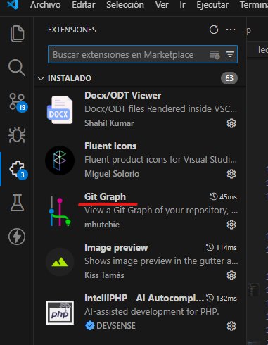
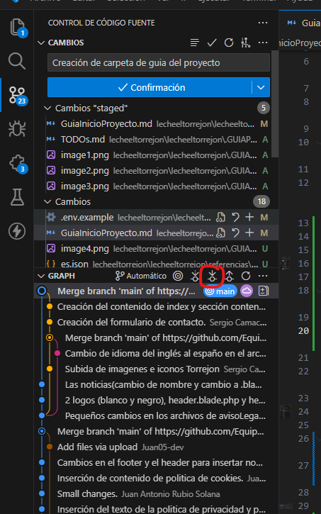
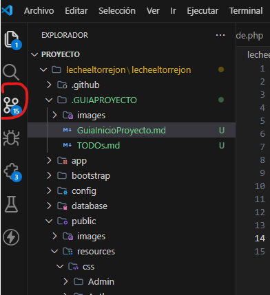
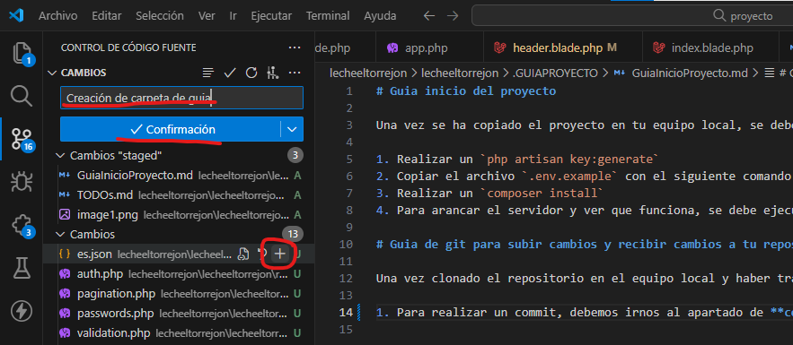
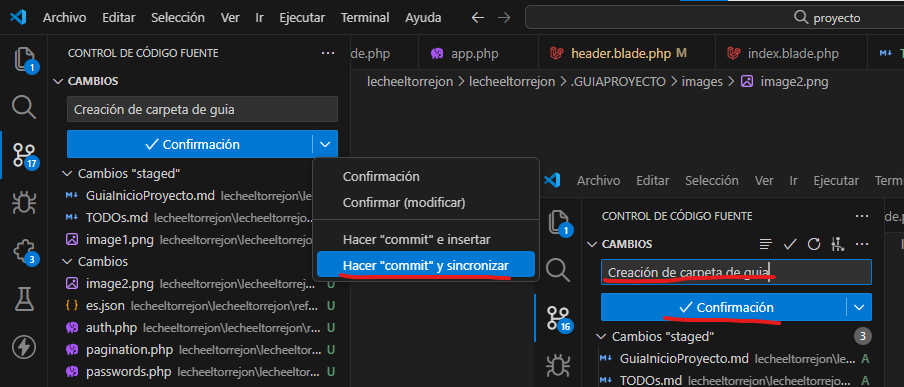
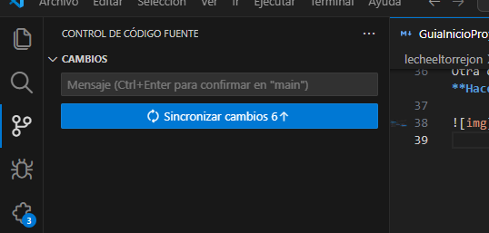

# Guia inicio del proyecto

Una vez se ha copiado el proyecto en tu equipo local, se debe realizar los siguientes pasos.

1. Primero debemos entrar a la carpeta raiz donde esta el proyecto con el comando `cd ./(nombreCarpeta)`
2. Realizar un `php artisan key:generate`
3. Copiar el archivo `.env.example` con el siguiente comando `cp .env.example .env` o `copy .env.example .env`
4. Realizar un `composer install`
5. Para arancar el servidor y ver que funciona, se debe ejecutar `php artisan serve`

# Guia de git para subir cambios y recibir cambios a tu repositorio

Una vez clonado el repositorio en el equipo local y haber trabajo, si se quiere realizar commits y subirlos al repositorio, se debe hacer lo siguiente:

Antes de nada se debe tener instalado la extensión **Git GRAPH**

# PASO IMPORTANTE ANTES DE REALIZAR UN COMMIT O CUANDO HAYA CAMBIOS EN EL REPOSITORIO

En la extensión de **Git GRAPH**, para traer los cambios, se debe dar donde pone `pull`.

1. Para realizar un commit, debemos irnos al apartado de **control de código fuente**

2. Ahora debemos seleccionador en el más los archivos que queremos que se suban al repositorio.
   Escribimos un mensaje del "commit" y le damos a **Confirmación**

3. Una vez habiendo escrito el mensaje aparecerá donde pone **Confirmación** un botón que pone **Sincronizar cambios x**, hay que darle ahí.

Otra opción, es darle a los tres puntitos y en la opción de **Hacer "commit" y sincronizar**

